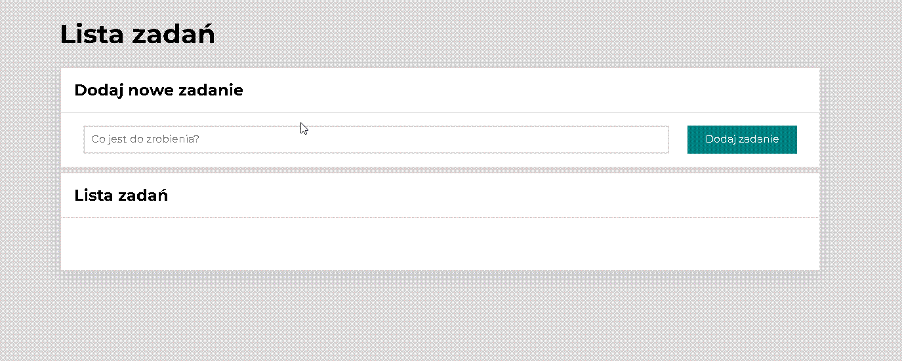

# 💪 To do list - how to use❔
This website has only one specific function, look:
👆 https://grzegorz-kolaty.github.io/to-do-list/ 👆

## 🧑 Do not forget to see my homepage❕
My homepage 👆 https://grzegorz-kolaty.github.io/homepage/ 👆

Please do not forget to check my other projects on my homepage - trying to be best developer you can find here :)

## ⚒ My work

Currency converter  👆 https://grzegorz-kolaty.github.io/currency-converter/ 👆

## ⚙ Used technologies and languages
- HTML
- CSS
- BEM
- Flex, Grid, OpenGraph
- JavaScript
- ES6+ features
- projects are DesktopFirst (not MobileFirst) but completly adjusted for smartphones!

